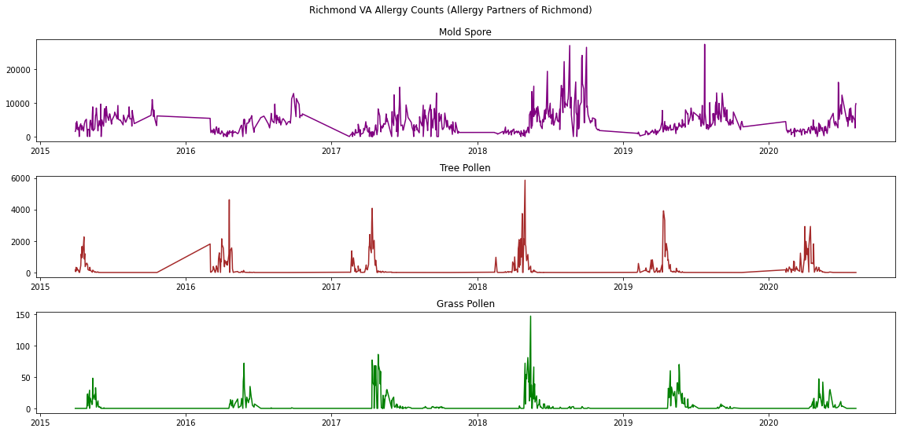

# rva-allergies

The [Allergy Partners of Richmond twitter account](https://twitter.com/AP_Richmond) offers a great public service by posting daily pollen and spore counts throughout much of the year. This is a tiny bit of code to collect the data, store it, and plot it in time series.

